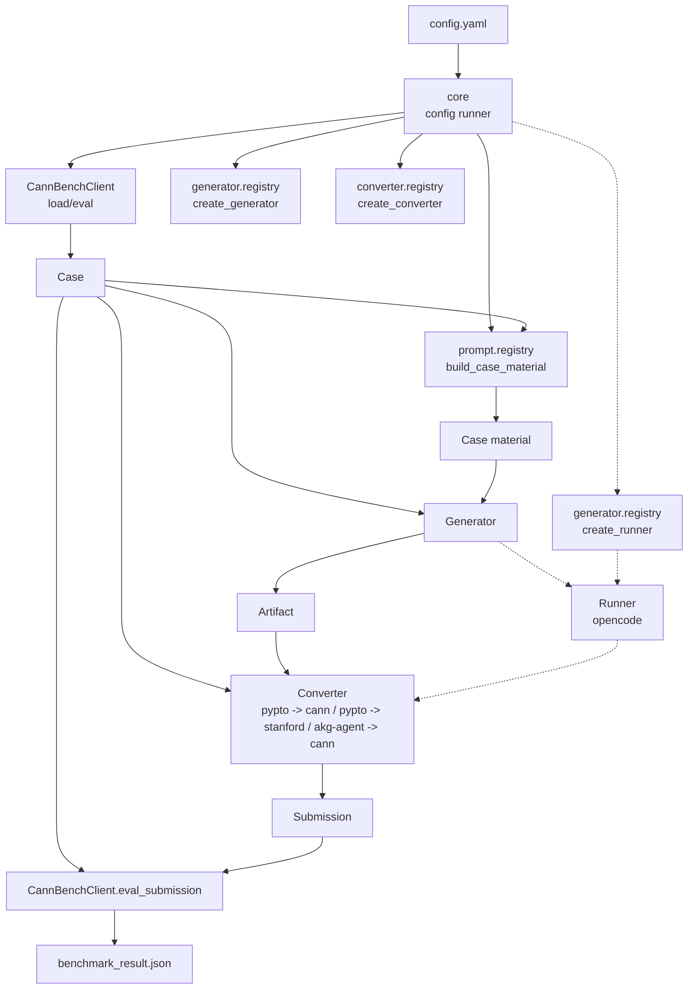
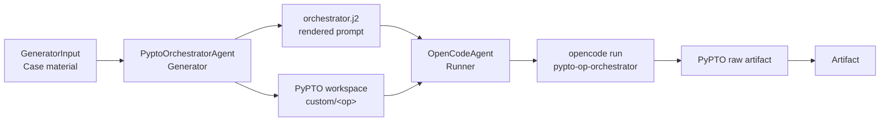

# auto_pipeline 当前实现说明

本文档按当前代码实现描述 `src/auto_pipeline/`。它不是历史运行记录，也不依赖
`benchmark_runs/` 中的实验产物。

## 1. 定位

`auto_pipeline` 是 cann-bench 仓内的配置驱动端到端流水线。当前抽象是：

```text
Core load case -> Prompt -> Generator -> Artifact -> Converter -> Submission -> Core eval
```

它只负责四件事：

1. 让 `core.CannBenchClient` 加载 case，并让 `prompt` package 构造 generator 所需的结构化 case material。
2. 调用 `Generator`，得到 `Artifact`。
3. 调用 `Converter`，把 `Artifact + bench_name + Case` 转成 `Submission`，并检查提交格式。
4. 调用 `core.CannBenchClient.eval_submission()`，把 submission 交给 `kernel_eval`。

它不实现 correctness verifier，不绕过 `kernel_eval` 自行判定精度或性能。

运行入口、CLI 参数和示例配置见
[`docs/guide/auto_pipeline_usage.md`](../guide/auto_pipeline_usage.md)。

## 2. 实际链路

单 case 运行链路：

```text
config.yaml
  |
  v
core.run_from_mapping()
  |
  v
CannBenchClient.load_case()
  |
  v
prompt.build_case_material()
  |
  v
Generator.generate()
  |
  v
Converter.convert()
  |
  v
[optional] Runner.run()
  |
  v
CannBenchClient.eval_submission()
  |
  v
benchmark_result.json / batch_result.json
```

组件依赖关系。图中实线表示主要调用/数据流，虚线表示可选 runner：



关键依赖方向：

- `core` 拥有 case 加载、pipeline 编排、kernel_eval boundary 和报告。
- `prompt` 只拥有 case material 构造。
- `Generator` 只依赖 `GeneratorInput`，不依赖 converter 或 `kernel_eval`。
- `Artifact` 是 generator 和 converter 之间的唯一生成产物 contract。
- `Converter` 依赖 `bench_name + Case + Artifact`，拥有 submission contract/check。
- `Runner` 只执行 prompt/命令，不理解 benchmark 语义。
- `BenchmarkPipeline` 只编排阶段，不理解 PyPTO/AKG/CANN/Stanford 细节。

核心数据结构：

| 类型 | 用途 |
|------|------|
| `CaseMaterial` | prompt package 为 generator 准备的 task 文件、op_name、REQUIRE 文本和 prompt context |
| `GeneratorInput` | core 传给 generator 的结构化 case material 和运行上下文 |
| `RunnerPrompt` | runner 的实际 prompt、工作目录、输出目录、env、文件和 metadata |
| `Artifact` | generator/runner 返回的状态、workdir、文件表、日志、metadata 和文本输出 |
| `Submission` | 已整理好的 benchmark submission 目录及其 metadata |

当前 Protocol：

| Protocol | 文件 | 边界 |
|----------|------|------|
| `Generator` | `core.py` | `GeneratorInput -> Artifact` |
| `Runner` | `generator/base.py` | `RunnerPrompt -> Artifact`，只执行 prompt/命令 |
| `Converter` | `converter/base.py` | `bench_name + Case + Artifact -> Submission`，可选复用 `Runner` |

`PipelineRunResult.ok` 只有在 pipeline 状态为 `success` 且 `kernel_eval` 返回码为 0
时才为真。

## 3. 目录与模块

```text
src/auto_pipeline/
├── cli.py
├── core.py
├── generator/
│   ├── opencode/
│   ├── akg/
│   │   └── converter/
│   └── pypto/
│       └── converter/
├── prompt/
├── converter/
└── ...
```

主要模块：

| 模块 | 职责 |
|------|------|
| `core.py` | 核心数据模型、YAML 配置解析、pipeline 编排、kernel_eval boundary、报告写入 |
| `prompt/` | case material 构造，只保留 prompt 能力 |
| `generator/` | generator 和 runner 实现及 registry |
| `converter/` | converter protocol、registry 和 submission 格式检查；具体 converter 实现归属 generator package |

## 4. 边界

Core / CannBenchClient 负责“题在哪里、怎么评”：

- 加载 task 文件。
- 调用 `kernel_eval`。

Prompt 负责“题怎么给 generator”：

- 根据 `bench_name` 和 case 文件构造 case material。
- 生成 REQUIRE 文本和 prompt context。

Generator 负责“怎么生成”：

- 决定 workspace 布局。
- 决定是否以及如何调用 runner。
- 产生 `Artifact`。

Runner 只负责执行：

- `opencode` 调用 `opencode run`。
- converter 需要外部模型/命令时也复用 runner。
- OpenCode runner 拥有命令构造、`PROMPT.md`、env、timeout、日志、live bridge 和
  session export；generator 不重复实现这些执行细节。

Converter 负责“怎么交卷”：

- 可选生成 conversion prompt 并调用 runner。
- 验证/打包 artifact 为 CANN 或 Stanford 可接受的 submission。
- 不修复 generation 阶段的 kernel 语义。

## 5. 配置边界

配置解析属于 `core.py`，但具体运行方法不放在 design 文档里。这里保留设计边界：

- YAML 描述实验意图：`agent.type`、agent 静态策略、`benchmark.name` 和 tasks。
- runtime CLI 参数描述本次运行：workspace、model、output、devices、parallel。
- `agent.type + benchmark.name` 选择 converter。
- workdir、convert、submission、eval report 都由 runtime `output` 固定推导。

完整用法见
[`docs/guide/auto_pipeline_usage.md`](../guide/auto_pipeline_usage.md)。

## 6. PyPTO 路径

`pypto` generator 直接消费 `GeneratorInput`，在 PyPTO workspace 中准备：

```text
custom/<op>/
├── REQUIRE.md
├── proto.yaml / task_desc.py / ...
└── ...
```

随后只渲染一次 `generator/pypto/templates/orchestrator.j2`，并调用：

```text
opencode run --agent pypto-op-orchestrator <prompt>
```

内部依赖关系：



边界：

- `PyptoOrchestratorAgent` 是 generator，只负责 case material 到 PyPTO workspace、
  PyPTO prompt、artifact/state 判定。
- `OpenCodeAgent` 是 runner，只负责一次 `opencode run` 的命令、env、日志、
  prompt 文件、live bridge、session export 和进程生命周期。
- `Converter` 后续再把 raw PyPTO artifact 归一成 benchmark submission。

PyPTO artifact 通常是：

```text
SPEC.md
<op>_impl.py
<op>_golden.py
test_<op>.py
.orchestrator_state.json
```

这些不是标准 CANN/Stanford submission，通常需要 `convert.runner`。
conversion 输入会主动收窄：

- task 侧跳过 golden、test、report、readme、doc 等辅助文件。
- artifact 侧只收集 `*_impl.py`，排除 `*_pypto_impl.py`。

## 7. Triton Ascend / AKG 路径

`akg-agent` generator 调用 AKG workflow，返回 generated artifact。
`akg-agent -> cann` converter 负责把 generated code 打包为：

```text
submission/
├── build.sh
├── setup.py
├── benchmark_submission.json
└── cann_bench/
    ├── __init__.py
    ├── <function_name>.py
    └── <function_name>_triton_ascend_impl.py
```

converter 会从 schema 推导函数名、tensor input、attrs/defaults，并生成 CANN
benchmark 调用 wrapper。
